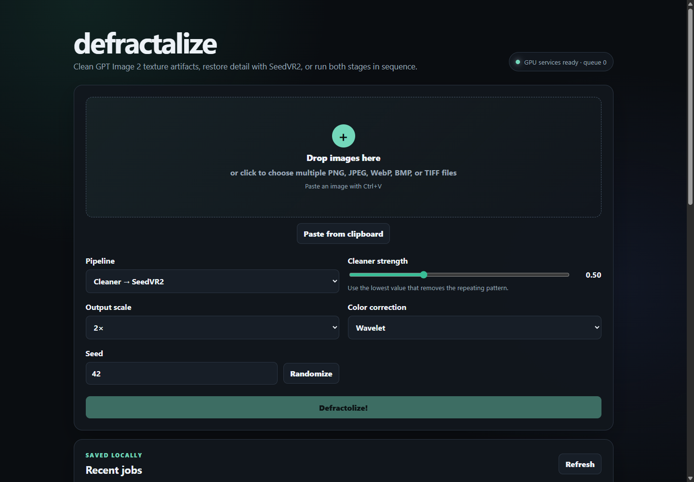
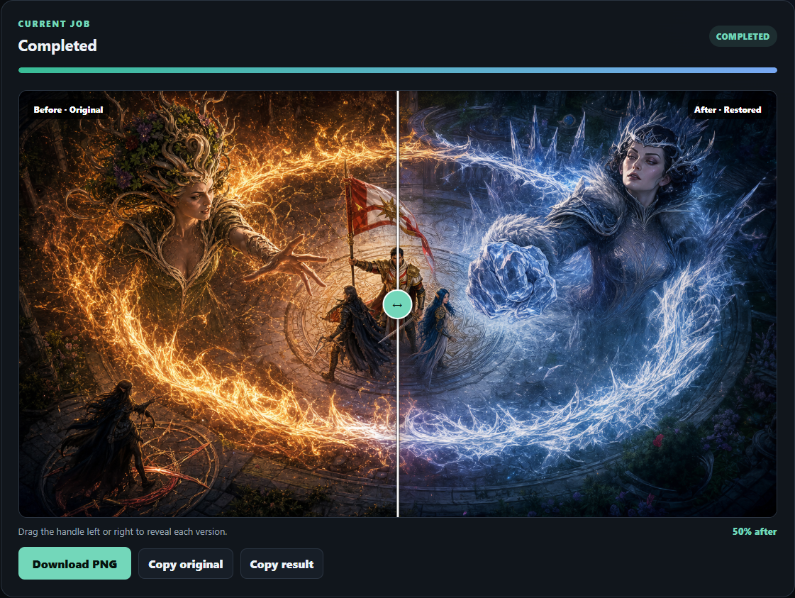
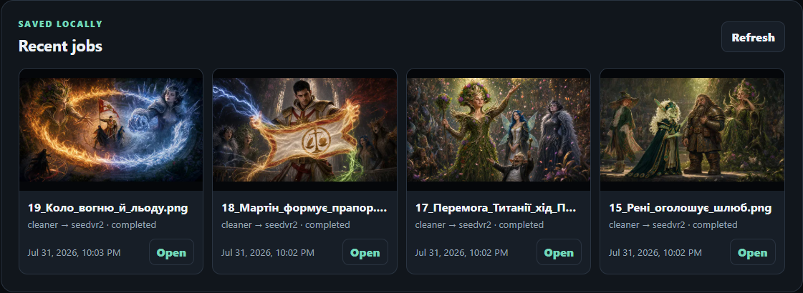

# defractalize

A local, shareable web application and HTTP API for two image-only restoration stages:

1. **GPT Image 2 Artifact Cleaner** removes the repeating diamond, mesh, scale, or
   honeycomb microtexture sometimes spread across unrelated materials.
2. **SeedVR2-1.4B distilled** reconstructs and upscales detail with a one-step
   still-image workflow.

The combined pipeline always runs the cleaner first and SeedVR2 second. GPU jobs are
serialized, and the cleaner releases its models before SeedVR2 begins, so the tested
12 GB GPU configuration does not need both models resident at once. After SeedVR2
finishes, the gateway requests a model unload and waits for ComfyUI to confirm that
its PyTorch VRAM reservation has been released before marking the job complete. If a
timed-out node ignores ComfyUI's interrupt request, the SeedVR worker restarts
automatically so a failed job cannot leave the GPU busy.

## Screenshots

### Web interface



### Interactive before/after comparison



### Recent results



## What is included

- A FastAPI gateway on `http://localhost:8080`
- A dependency-free multi-image drag-and-drop and clipboard-paste web interface
- A persistent, single-worker job queue
- Per-image before/after comparison, clipboard copy, PNG download, and recent-result previews
- A dedicated artifact-cleaner API container
- A pinned ComfyUI/SeedVR2 container
- Runtime model downloads cached in Docker volumes
- OpenAPI documentation at `http://localhost:8080/docs`

Uploaded images and job results stay in the `gateway_data` Docker volume. Model weights
are not committed to this project or baked into the source tree.

## Requirements

- Windows 11 with Docker Desktop/WSL2, or a recent Linux distribution
- Docker Engine with Compose v2
- An NVIDIA GPU visible to containers
- NVIDIA Container Toolkit on Linux
- A current NVIDIA driver compatible with the CUDA 13.0 PyTorch build
- Approximately 12 GB of VRAM recommended and 20 GB of free disk space

The stack was tested for image-only work on an RTX 4070 Ti 12 GB. Smaller GPUs may run
out of memory, especially with large inputs or 3–4× output scaling. There is no CPU
fallback in the default Compose configuration because it would be impractically slow.

## Start

PowerShell:

```powershell
Copy-Item .env.example .env
docker compose up --build
```

Bash:

```bash
cp .env.example .env
docker compose up --build
```

Then open <http://localhost:8080>. The gateway starts immediately, but the GPU services
remain unavailable until their first model downloads finish. Follow startup with:

```bash
docker compose logs -f cleaner seedvr
```

The initial build installs the CUDA-enabled PyTorch runtime in two images. On first
start, the services also download FLUX.2 VAE and SeedVR2 assets into named volumes.
Subsequent starts reuse those files.

Stop the services without removing saved data or models:

```bash
docker compose down
```

## Recommended settings

- Begin artifact cleanup at `alpha=0.25`.
- Try `0.50` when the pattern remains visible and `0.75` for strong contamination.
- Choose the lowest alpha that fixes the pattern without softening faces, eyes, fingers,
  fur, foliage, or fine equipment.
- Use SeedVR2 at 1× to restore detail without changing dimensions.
- Use 2× for a practical upscale. A 4× output uses substantially more time and memory.
- Wavelet color correction is a good default because it retains generated
  high-frequency detail while matching low-frequency color.
- SeedVR2 is a generative restoration model: inspect faces, hands, text, symbols, and
  exact costume details after every run.

Do not run an image through the cleaner when it does not have the repeating artifact.
Even a low-alpha VAE pass can alter legitimate detail.

## API

Submit a combined job:

```bash
curl -X POST http://localhost:8080/api/jobs \
  -F "file=@input.png" \
  -F "pipeline=cleaner_seedvr2" \
  -F "alpha=0.50" \
  -F "scale=2" \
  -F "color_correction=wavelet" \
  -F "seed=42"
```

Valid pipelines are `cleaner`, `seedvr2`, and `cleaner_seedvr2`. Query and download the
returned job ID:

```bash
curl http://localhost:8080/api/jobs/JOB_ID
curl -o restored.png http://localhost:8080/api/jobs/JOB_ID/result
```

Other endpoints:

- `GET /api/health` — gateway queue and backend availability
- `GET /api/jobs` — recent persistent jobs
- `GET /api/jobs/{id}/input` — original upload
- `DELETE /api/jobs/{id}` — remove a completed or failed job

The API intentionally accepts only image files and limits uploads to 50 MB by default.
Change `MAX_UPLOAD_MB` in `.env` if required.

## Debugging

Expose both internal APIs on localhost:

```bash
docker compose -f compose.yaml -f compose.debug.yaml up
```

- Cleaner API: <http://localhost:8001/docs>
- ComfyUI: <http://localhost:8188>

Check GPU access:

```bash
docker compose exec cleaner python -c "import torch; print(torch.cuda.get_device_name())"
docker compose exec seedvr python -c "import torch; print(torch.cuda.get_device_name())"
```

If a build cannot find the pinned CUDA wheel, override `PYTORCH_INDEX_URL` and the pinned
package versions in both backend Dockerfiles together. PyTorch, torchvision, and
torchaudio versions must remain mutually compatible.

Remove only generated jobs:

```bash
docker compose down
docker volume rm image-restoration-stack_gateway_data
```

Remove all jobs and downloaded models:

```bash
docker compose down -v
```

The latter is destructive and forces all model downloads to run again.

## Security and sharing

The default port is bound to `127.0.0.1`, and the application has no user accounts,
authentication, rate limiting, or TLS. Do not change that binding to a public address
without placing an authenticated reverse proxy in front of it.

Share the source directory rather than prebuilt images unless you have reviewed all
redistribution obligations. Exact upstream revisions are pinned through `.env`.

## Licensing

The original gateway, orchestration, and UI code in this directory is MIT licensed.
The stack as configured is **not a commercial-use bundle**:

- `Larryvrh/gpt-image-2-artifact-cleaner` uses PolyForm Noncommercial 1.0.0.
- FLUX.2 VAE and SeedVR2-1.4B declare Apache 2.0.
- ComfyUI uses GPL-3.0.

See [THIRD_PARTY_NOTICES.md](THIRD_PARTY_NOTICES.md) and the upstream license files
before redistribution or commercial use. This summary is not legal advice.

## Pinned revisions

- Artifact cleaner: `5389c6a3bd0eb245ea380bcfcf4c75845709d2da`
- ComfyUI: `9cf91339b708a245762fa38ffeec9702b381e0db`
- SeedVR2-1.4B: `7694e0f361dde8521668e9f8e1d242a1ee90035a`
